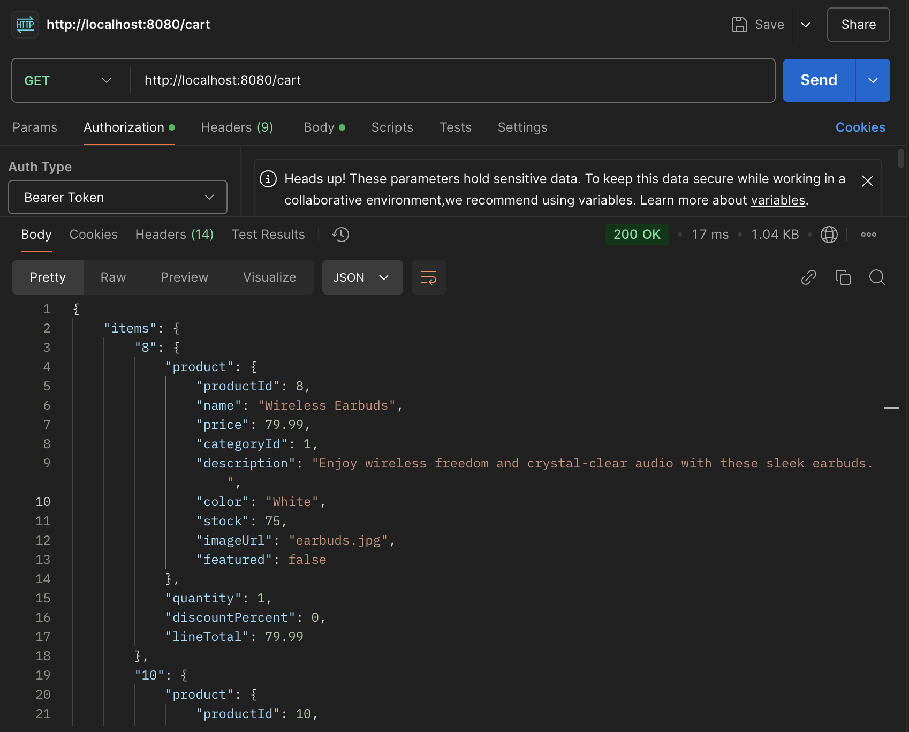
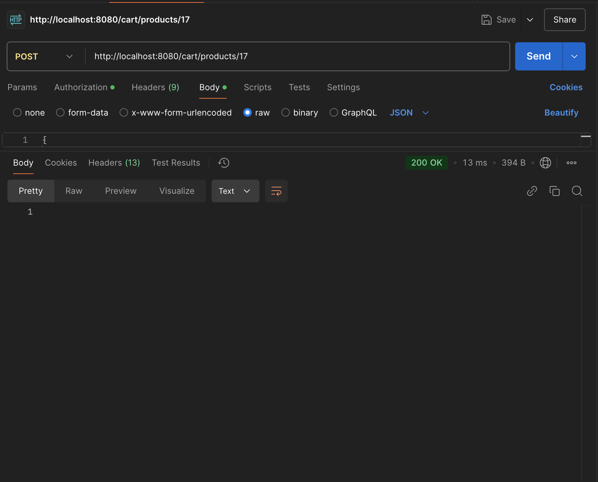
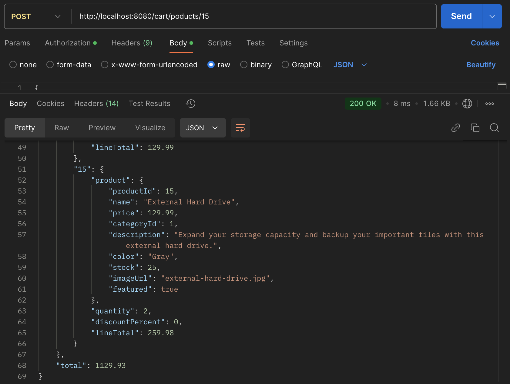
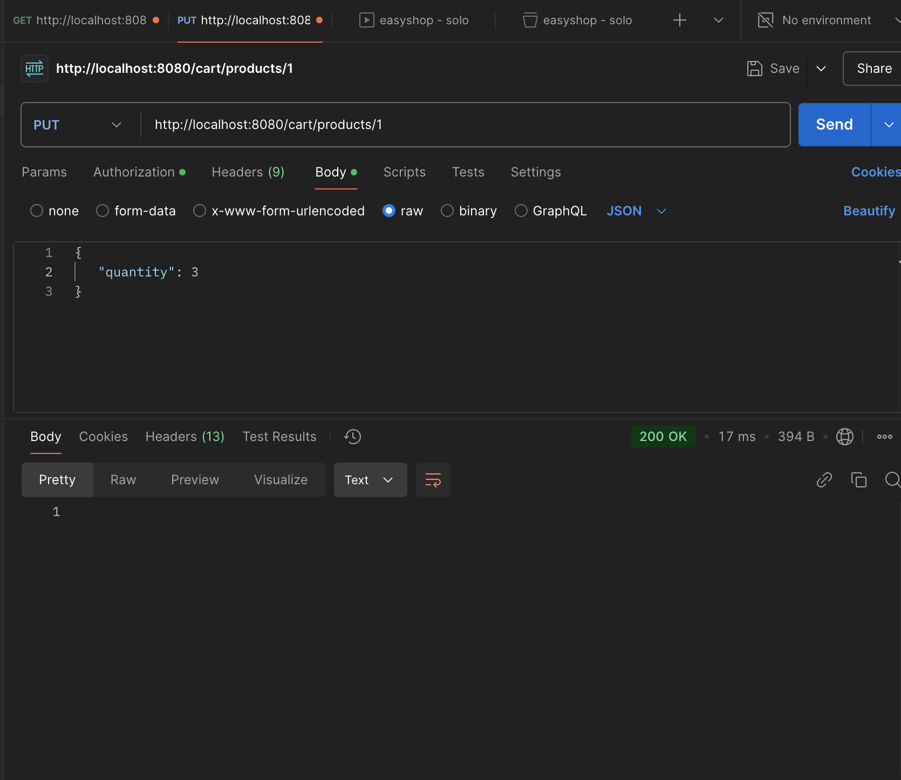
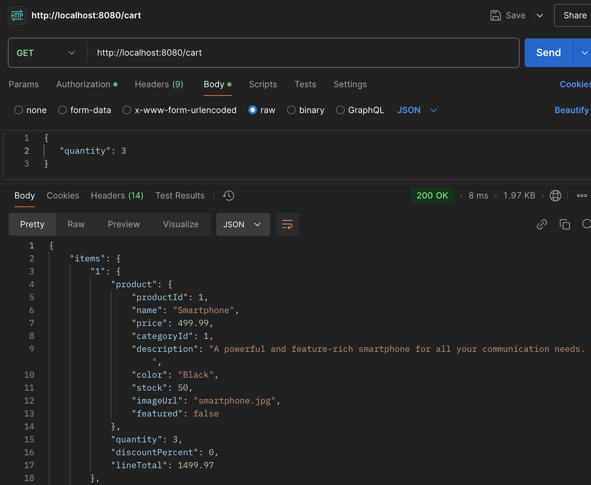
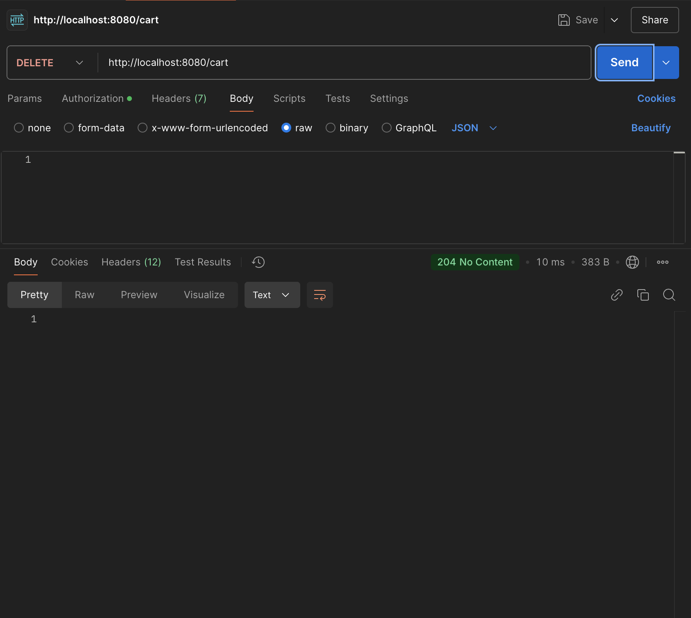

# EASY SHOP

## Description of the Project

The Easy Shop Application is a Java-based REST API designed to manage product categories and products for an e-commerce platform. It provides functionality for administrators to manage categories (add, update, delete) and for users to view available categories and products. The application ensures secure role-based access control, where only administrators can perform sensitive operations, while all users can access general data like categories and products.

This project aims to streamline product and category management, providing a clean and efficient API structure for future integration with frontend applications.

## User Stories

- *As an admin*, I want to add new categories, so that products can be grouped under relevant categories.
- *As an admin*, I want to update existing categories, so that the category information stays relevant and up-to-date.
- *As a user*, I want to view all available product categories, so that I can explore products under those categories.
- *As a logged-in user*, I want to view my shopping cart so that I can see the items I plan to purchase.
- *As a logged-in user*, I want to update product quantities in my cart so that I can adjust my order as needed.

## Setup

Instructions on how to set up and run the project using IntelliJ IDEA.

### Prerequisites

- IntelliJ IDEA: Ensure you have IntelliJ IDEA installed, which you can download from [here](https://www.jetbrains.com/idea/download/).
- Java SDK: Make sure Java SDK is installed and configured in IntelliJ.
- MySQL Database: Set up a MySQL database for the backend.

### Running the Application in IntelliJ

Follow these steps to get your application running within IntelliJ IDEA:

1. Open IntelliJ IDEA.
2. Select "Open" and navigate to the directory where you cloned or downloaded the project.
3. After the project opens, wait for IntelliJ to index the files and set up the project.
4. Find the main class with the `public static void main(String[] args)` method.
5. Right-click on the file and select 'Run 'YourMainClassName.main()'' to start the application.

## Technologies Used

- Java: Mention the version you are using.
- MySQL: Relational database for data storage.
- Spring Boot: Framework for building REST APIs.
- Postman: API testing tool to verify all endpoints.

## Challenges Faced
###  1. HTTP Status Code Issues:
Initially, the POST method for adding a new category returned a default 200 OK. We resolved this by adding the @ResponseStatus(HttpStatus.CREATED) annotation to ensure compliance with RESTful standards and return 201 Created when a new resource is added.
### 2. Error Handling:
Implementing proper error handling was crucial. We used ResponseStatusException to return consistent and meaningful HTTP responses like 404 Not Found for missing resources and 500 Internal Server Error for unexpected failures.

## Demo

### *Postman Run Result* 

### *Cart Login*

### *POST - 200OK*

### *POST - updated cart*

### *PUT - 200OK*

### *POST - updated cart*

### *DELETE 204*

## Future Work

Outline potent# EASY SHOP

## Description of the Project

The Easy Shop Application is a Java-based REST API designed to manage product categories and products for an e-commerce platform. It provides functionality for administrators to manage categories (add, update, delete) and for users to view available categories and products. The application ensures secure role-based access control, where only administrators can perform sensitive operations, while all users can access general data like categories and products.

This project aims to streamline product and category management, providing a clean and efficient API structure for future integration with frontend applications.

## User Stories

List the user stories that guided the development of your application. Format these stories as: "As a [type of user], I want [some goal] so that [some reason]."

- *As an admin*, I want to add new categories, so that products can be grouped under relevant categories.
- *As an admin*, I want to update existing categories, so that the category information stays relevant and up-to-date.
- *As a user*, I want to view all available product categories, so that I can explore products under those categories.
- *As a logged-in user*, I want to view my shopping cart so that I can see the items I plan to purchase.
- *As a logged-in user*, I want to update product quantities in my cart so that I can adjust my order as needed.

## Setup

Instructions on how to set up and run the project using IntelliJ IDEA.

### Prerequisites

- IntelliJ IDEA: Ensure you have IntelliJ IDEA installed, which you can download from [here](https://www.jetbrains.com/idea/download/).
- Java SDK: Make sure Java SDK is installed and configured in IntelliJ.
- MySQL Database: Set up a MySQL database for the backend.

### Running the Application in IntelliJ

Follow these steps to get your application running within IntelliJ IDEA:

1. Open IntelliJ IDEA.
2. Select "Open" and navigate to the directory where you cloned or downloaded the project.
3. After the project opens, wait for IntelliJ to index the files and set up the project.
4. Find the main class with the `public static void main(String[] args)` method.
5. Right-click on the file and select 'Run 'YourMainClassName.main()'' to start the application.

## Technologies Used

- Java: Mention the version you are using.
- MySQL: Relational database for data storage.
- Spring Boot: Framework for building REST APIs.
- Postman: API testing tool to verify all endpoints.

## Challenges Faced
###  1. HTTP Status Code Issues:
Initially, the POST method for adding a new category returned a default 200 OK. We resolved this by adding the @ResponseStatus(HttpStatus.CREATED) annotation to ensure compliance with RESTful standards and return 201 Created when a new resource is added.
### 2. Error Handling:
Implementing proper error handling was crucial. We used ResponseStatusException to return consistent and meaningful HTTP responses like 404 Not Found for missing resources and 500 Internal Server Error for unexpected failures.

## Demo

### *Postman Run Result*

### *Cart Login*

### *POST - 200OK*

### *POST - updated cart*

### *PUT - 200OK*

### *POST - updated cart*

### *DELETE 204*

## Future Work

- Build a user-friendly frontend to visualize and interact with the API.

## Resources

- [Java Programming Tutorial](https://www.example.com)
- [Effective Java](https://www.example.com)
## Thanks

- Thank you to Raymond for continuous support and guidance.ial future enhancements or functionalities you might consider adding:

- Build a user-friendly frontend to visualize and interact with the API.

## Resources

- [Java Programming Tutorial](https://www.example.com)
- [Effective Java](https://www.example.com)
- 
## Thanks

- Thank you to Raymond for continuous support and guidance.